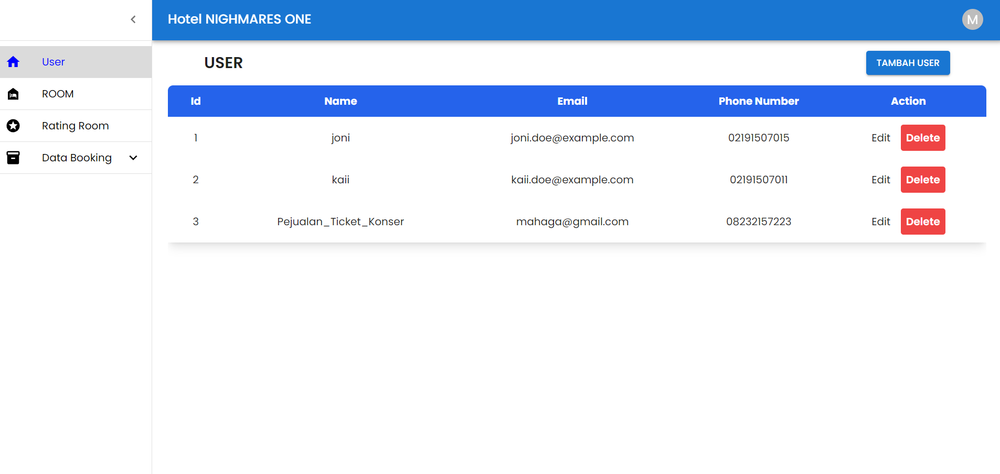
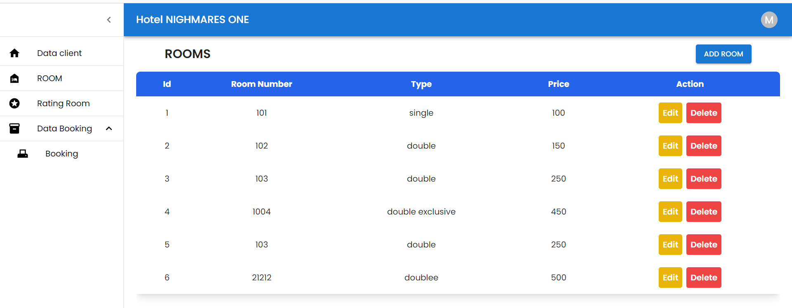
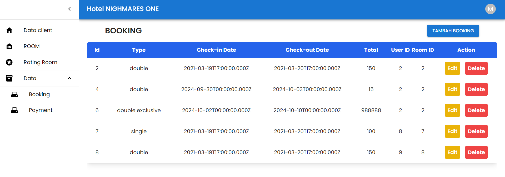
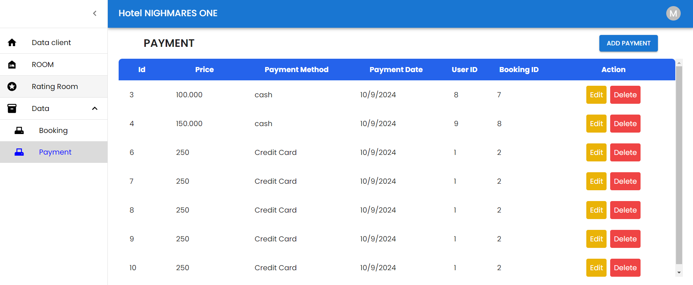

# Booking sistem hotel

This project is a simple **Booking & Payment System** built using React and Material-UI. It allows users to manage bookings and payments by adding, editing, and deleting records through an API.

## Table of Contents routing
- user
- room
- rating room
- booking
- Payment

---

## Overview
This project implements a booking and payment management system that allows users to:
- View a list of bookings and payments.
- Add new bookings and payments.
- Edit existing records.
- Delete records.

The app fetches data from an API and displays it in a table. Users can interact with this data using forms and modals provided by Material-UI components.

## Components Explanation

YANG DIGUNAKAN DALAM PEMBUATAN PROJECT
React - JavaScript library for building user interfaces.
Tailwind CSS - A utility-first CSS framework.
Axios - Promise-based HTTP client for API requests.
React Router DOM - A library for routing in React applications, providing a way to navigate between different components or pages within a web application.

## hasilnya

- **Hasil User**

- **Hasil Room**

- **Hasil Booking**

- **Hasil Reviews**

- **Hasil Payment**

 

## Authors
- **Your Name** – [(https://github.com/MahagaNajwanKaidan/)]
